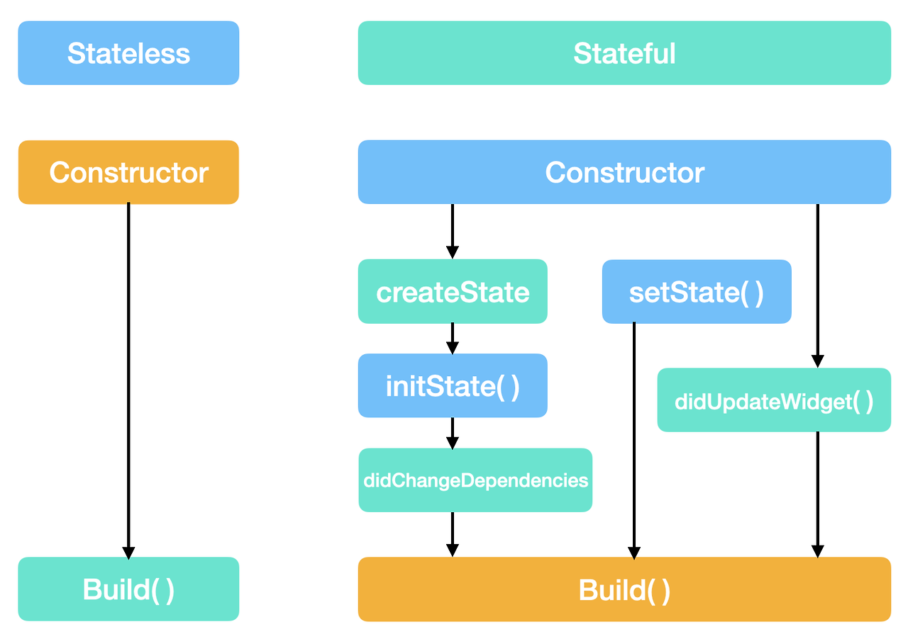
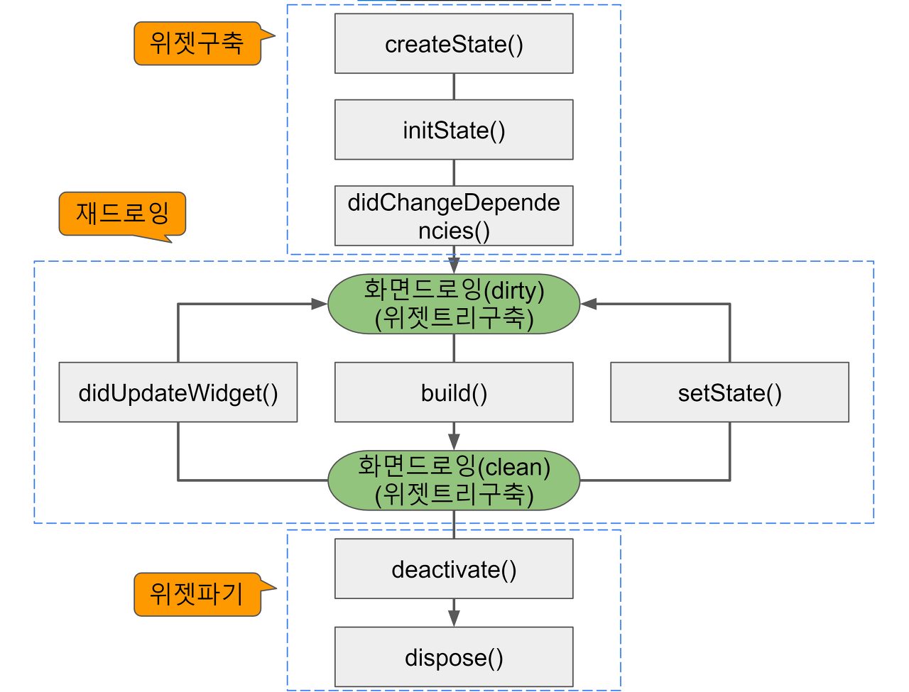

# LifeCycle - App
- created: 앱이 시작될 때
- resumed: 앱이 포그라운드에 있고 사용자 입력 받음
- inactive: 앱이 백그라운드에 이동 중이거나 부분적으로 가려짐
- paused: 앱이 백그라운드에 있지만 메모리에 유지되는 상태
- detached: 앱이 호스트에서 실행중이나 뷰에서 분리됨

# LifeCycle - Stateful Widget
## Stateful vs. Stateless Widget

## Stateful Widget LifeCycle

### 위젯 구축 과정
- createState()
    - StatefulWidget을 구축한 경우 호출
    - 위젯 트리에 상태를 만든다.
    - flutter에서 stateful widget을 자동으로 만드는 단축키를 누를 때, createstate() => ... 이 자동완성 되어있는 이유 생각해보기.
- initState()
    - 위젯이 생성될 때 호출되는 메서드 입니다.
    - state 초기화를 합니다.
    - **단 한번만** 호출됩니다.
- didChangeDependencies()
    - state 변경될 때 호출됩니다.
    - initState뒤에 호출되지만, 그 외의 상황에도 호출됩니다.
### 재 드로잉
- build()
    - 위젯으로 만든 UI를 구축합니다.
    - 이 부분에 계산이 많으면 앱 성능 저하.
    - 다양한 곳에서 반복 호출됩니다.
    - 가장 많이 호출되며, 반드시 존재해야 합니다.
    - override의 대상입니다.
    - 반드시 Widget을 반환해야합니다.
- didUpdateWidget()
    - 위젯의 구성이 변경될 때 마다 호출됩니다.
    - 부모 위젯이 변경되고 다시 그려져야 할 때 호출됩니다.
    - oldWidget 인수를 취득해 비교합니다.
- setState
    - 상태가 변경되었을 때, 프레임 워크에 상태가 변경됨을 알립니다.
        - 이는 build()가 호출될 수 있도록 합니다.
### 화면 파기
- deactive()
    - state 오브젝트가 트리로부터 삭제될 때 마다 호출됩니다.
- dispose()
    - 객체가 트리에서 완전히 삭제되고 두번다시 빌드되지 않으면 호출됩니다.
    - 사용되었던 것들을 영구적으로 제거하여 메모리 누수를 방지합니다.

